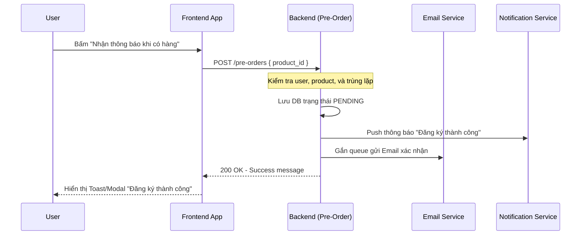
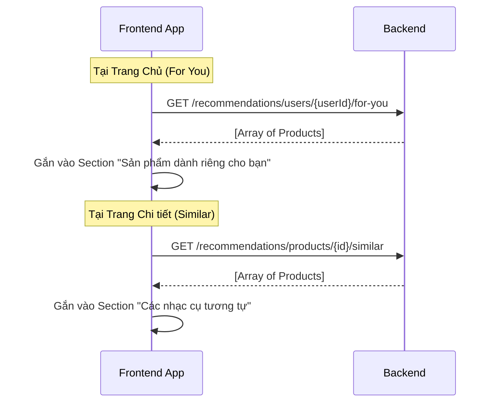

# Hướng dẫn Tích hợp Frontend: Recommendation, Pre-Orders & Notifications 🚀

Tài liệu này định nghĩa chi tiết các luồng nghiệp vụ (Business Flows) và cách gọi API dành cho đội ngũ Frontend (FE) khi làm việc với 3 modules chính: **Gợi ý sản phẩm (Recommendation)**, **Đăng ký nhận thông báo khi có hàng (Pre-orders)**, và **Hệ thống chuông thông báo (Notifications)**.

---

## 1. Module Pre-Orders (Đăng ký nhận thông báo khi có hàng)

### 1.1 Quy trình nghiệp vụ (Flow)

Khi truy cập trang **Chi tiết sản phẩm (Product Detail Page)**, nếu sản phẩm có `stock_quantity = 0` (Hết hàng), FE sẽ thay thế nút "Thêm vào giỏ" bằng nút "Nhận thông báo khi có hàng".



### 1.2 Danh sách API tích hợp

| API Endpoint | Method | Auth Dùng? | Tham số (Body/Params) | Trả về (Ví dụ) |
| :--- | :---: | :---: | :--- | :--- |
| `/pre-orders` | `POST` | ✅ Trọng yếu | `{ product_id: 1, customer_note?: 'Giao nhanh' }` | `201 Created` - Cùng msg thành công |

> [!CAUTION]
> **Xử lý lỗi**:
> Nếu Backend trả về mã lỗi HTTP 400 với thông báo "Bạn đã đăng ký nhận thông báo cho sản phẩm này rồi", FE cần Toast Error hiển thị thông báo nhẹ nhàng cho khách hàng biết để tránh spam click.

---

## 2. Module Notifications (Quản lý chuông thông báo)

### 2.1 Quy trình nghiệp vụ (Flow)

Hệ thống thông báo thường nằm ở Header (Icon cái chuông) và sẽ re-fetch số lượng mỗi khi App khởi động hoặc reload trang.

```mermaid
flowchart TD
    A[Mở Web / Đăng nhập] --> B[Gọi API GET /unread-count]
    B --> C{count > 0?}
    C -->|Có| D[Hiển thị Badge đỏ có số]
    C -->|Không| E[Ẩn Badge]
    
    D --> F[Click vào Icon Chuông]
    E --> F
    
    F --> G[Gọi API GET /notifications?page=0&size=10]
    G --> H[Hiển thị danh sách thả xuống]
    
    H --> I[Click vào 1 item cụ thể]
    I --> J[Gọi PUT /notifications/{id}/read]
    J --> K[Chuyển màu item sang xám/đã đọc]
    
    H --> L[Click "Đánh dấu tất cả đã đọc"]
    L --> M[Gọi PUT /notifications/read-all]
    M --> N[Reset Badge đỏ về 0]
```

### 2.2 Danh sách API tích hợp

| API Endpoint | Method | Auth Dùng? | Tham số (Query/Params) | Công dụng trên FE |
| :--- | :---: | :---: | :--- | :--- |
| `/notifications/unread-count` | `GET` | ✅ | `Không có` | Render số lượng Badge màu đỏ trên chuông |
| `/notifications` | `GET` | ✅ | `?page=0&size=10` | Render danh sách Item. Response là mảng Objects |
| `/notifications/{id}/read` | `PUT` | ✅ | `id` (Param) | Khi user bấm vào dòng thông báo, gọi để bỏ in đậm |
| `/notifications/read-all` | `PUT` | ✅ | `Không có` | Khi user ấn nút "Mark all as read" ở Header |

> [!TIP]
> **Giao diện Item Thông báo**: FE dựa vào trường `type` (INFO, ORDER, PROMOTION, SYSTEM, PRE_ORDER) để render các Icon và màu nền tương ứng. Ví dụ: `PROMOTION` thì màu đỏ, `ORDER` thì icon giỏ hàng màu xanh lá.

---

## 3. Module Recommendations (Gợi ý sản phẩm)

### 3.1 Quy trình nghiệp vụ (Flow)

Recommendation được sử dụng ở 2 nơi chính: **Trang Chủ (Home)** và **Trang Chi Tiết (Product Detail)**. Cả 2 đều render dưới dạng Carousel/Slider.



### 3.2 Danh sách API tích hợp

| API Endpoint | Method | Auth Dùng? | Tham số (Params) | Vị trí đặt Component trên FE |
| :--- | :---: | :---: | :--- | :--- |
| `/recommendations/users/{userId}/for-you`| `GET` | ❌ (Có thể tuỳ biến) | `userId` (Lấy từ state đăng nhập) | Ở `/` (Homepage) dưới slider. |
| `/recommendations/products/{id}/similar` | `GET` | ❌ Không cần | `id` (Lấy từ URL hiện hành) | Cuối trang `/products/:slug/:id` |

> [!NOTE]
> Do recommendation APIs không sử dụng phân trang, thông thường danh sách trả về sẽ cố định 10-15 sản phẩm. Frontend nên dùng các thư viện như `Swiper.js` hoặc `Slick-carousel` để bo gọn nó lại.
